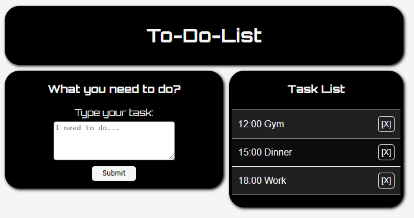

# 📝 Todo App

A simple and minimalistic Todo App built with HTML, CSS, and JavaScript.

## 🔗 Live Demo

[👉 Click here to view the demo](https://nickolaidev.github.io/project-todo-app)

## 🚀 Technologies Used

- HTML5
- CSS3
- Vanilla JavaScript

## 📚 What I Learned

- DOM manipulation
- Event handling
- Working with localStorage
- Building a dynamic UI from scratch

---

© 2025 NikolaiDev
